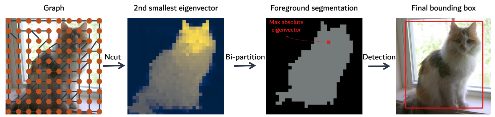
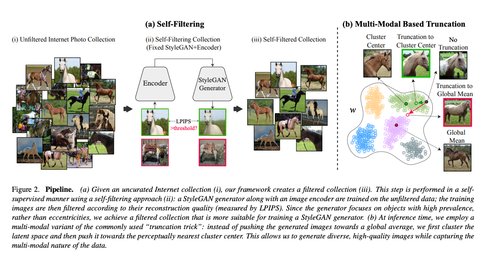

# This Mate Does Not Exist


## List of resources

- [Reddit Image Downloader](https://github.com/gwenya/reddit-image-downloader)
- [Self-supervised Transformers for Unsupervised Object Discovery using Normalized Cut](https://arxiv.org/pdf/2202.11539.pdf)
- [PyTorch implementation of TokenCut](https://github.com/YangtaoWANG95/TokenCut)
- [Hugging Face Spaces demo for TokenCut](https://huggingface.co/spaces/akhaliq/TokenCut)
- [Self-Distilled StyleGAN: Towards Generation from Internet Photos](https://arxiv.org/abs/2202.12211) by Google Research. [[Project Page](https://self-distilled-stylegan.github.io/)][[Code](https://github.com/self-distilled-stylegan/self-distilled-internet-photos)]

## Creating a dataset of internet images

Detic: A Detector with image classes that can use image-level labels to easily train detectors. This means you can use more than 20k classes from ImageNet 21K or combine it with CLIP embeddings to expand to any number of classes. Please have a look at the [original repo](https://github.com/facebookresearch/Detic) for more information and check my [YouTube Video](https://www.youtube.com/watch?v=Xw2icCN5ZpM) and [Repo](https://github.com/machinelearnear/detic-detecting-20k-classes-using-image-level-supervision) to get started easily.

## Pre-process and curate dataset
As explained in the official ["Self-Distilled StyleGAN" repository](https://github.com/self-distilled-stylegan/self-distilled-internet-photos), in order for us to get better results in our image generation, we need to pre-process and curate our dataset before feeding it to the model for training.

> StyleGAN’s fascinating generative and editing abilities are limited to structurally aligned and well-curated datasets. It does not work well on raw datasets downloaded from the Internet. The SDIP domains presented here, which are StyleGAN-friendly, were automatically curated by our method from raw images collected from the Internet. The raw uncurated images in Self-Distilled Flicker (SD-Flickr) were first crawled from Flickr using a simple keyword (e.g. 'dog' or 'elephant').

> The dataset in this page exhibits 4 domains: SD-Dogs (126K images), SD-Elephants (39K images), SD-Bicycles (96K images), and SD-Horses (162K images). Our curation process consists of a simple pre-processing step (off-the-shelf object detector to crop the main object and then rescale), followed by a sophisticated StyleGAN-friendly filtering step (which removes outlier images while maintaining dataset diversity). This results in a more coherent and clean dataset, which is suitable for training a StyleGAN2 generator (see more details in our paper).

> The data itself is saved in a json format: for SD-Flickr we provide urls of the original images and bounding boxes used for cropping; for SD-LSUN we provide image identifiers with the bounding boxes. In addition to the SDIP dataset, we also provide weights of pre-trained StyleGAN2 models trained using each image domain provided here.

As part of that pre-preprocessing, we are looking to crop the main object in the photo and rescale it, but there's a problem. As we are looking to generate synthetic images that have to do with Yerba Mate we quickly realise that there's not good off-the-shelf pre-trained detector that will fit the bill. Not even DETIC, which we covered [in the past](https://github.com/machinelearnear/detic-detecting-20k-classes-using-image-level-supervision), can accurately predict it. That's why we are going to be using a recently released paper from Samsung AI, Cambridge, and MIT, called "[Self-supervised Transformers for Unsupervised Object Discovery using Normalized Cut](https://arxiv.org/pdf/2202.11539.pdf)" that focuses on doing unsupervised object discovery. We are going to use it to detect the main object in the picture and crop accordingly.



## Generate images from internet photos
Now that we have downloaded, pre-processed, and curated our dataset, we are going to be using a recent paper from Google Research called "[Self-Distilled StyleGAN: Towards Generation from Internet Photos](https://arxiv.org/abs/2202.12211)" to generate our synthetic images.



To start the training, we run:

```python
# training code goes here once it's available
```

## References

```bibtex
@article{wang2022tokencut,
          title={Self-supervised Transformers for Unsupervised Object Discovery using Normalized Cut},
          author={Wang, Yangtao and Shen, Xi and Hu, Shell Xu and Yuan, Yuan and Crowley, James and Vaufreydaz, Dominique},
          journal={arXiv}
          year={2022}
        }
        

@misc{mokady2022selfdistilled, 
        title={Self-Distilled StyleGAN: Towards Generation from Internet Photos},
        author={Ron Mokady and Michal Yarom and Omer Tov and Oran Lang and 
            Daniel Cohen-Or, Tali Dekel, Michal Irani and Inbar Mosseri},
        year={2022},
        eprint={2202.12211}, 
        archivePrefix={arXiv}, 
        primaryClass={cs.CV} 
}
```
